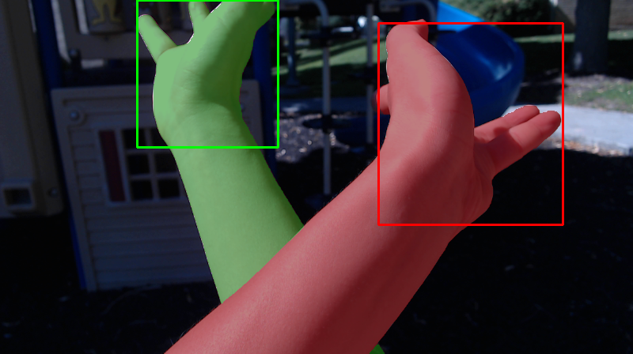
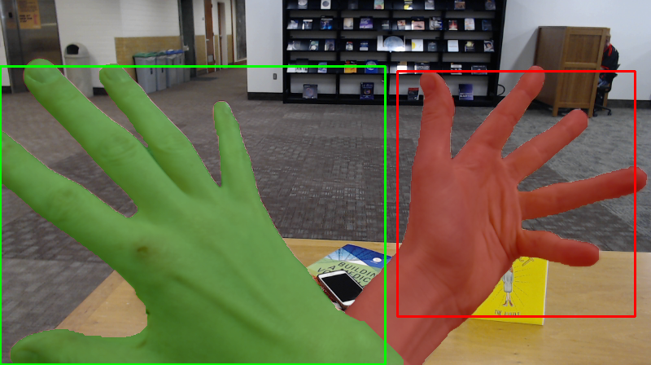
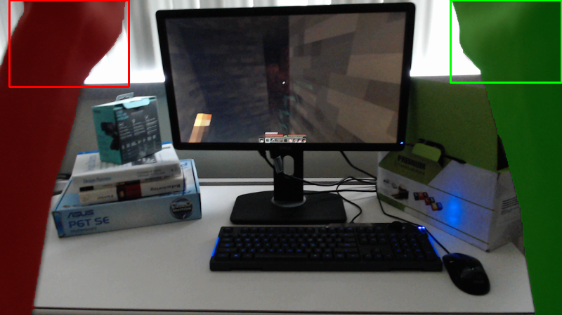
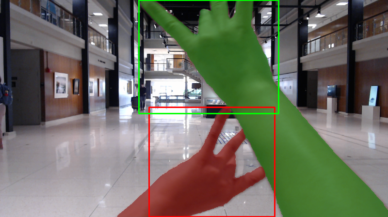
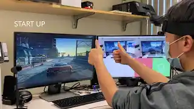

# Ego2Hands

    

    

Ego2Hands is a large-scale dataset for the task of two-hand segmentation/detection in unconstrained environments. The training set provides images of only the right hands from 22 subjects with segmentation and hand energy ground truth annotation, allowing compositing-based data generation for unlimited training data with segmentation and detection ground truth. The evaluation set provides 8 sequences from 4 subjects, covering different scenes, skin tones and various level of illumination. This dataset is introduced by our paper [Ego2Hands: A Dataset for Egocentric Two-hand Segmentation and Detection](https://arxiv.org/abs/2011.07252). 

See our [Youtube Demo](https://www.youtube.com/watch?v=WjmPgnDXiMA&ab_channel=AlexLin) for a sample application in color-based gesture control.

## Convolutional Segmentation Machine
We introduce a well-balanced architecture with compact model size, fast inference speed and high accuracy for real-time two-hand segmentation/detection. The implementation for training and testing is provided using Pytorch. 

To run the script, please follow the instructions below:

1. **Download the repository**
2. **Download the Ego2Hands dataset**
  * This dataset is about 90GB in size as its training set contains ~180k images with segmentation and energy, and its evaluation set contains 2k fully annotated images. Make sure you have enough space for this project. 
  * Use the following download links and put the data in the proper path:
  
    * **Ego2Hands (train):** [subject0-4](https://byu.box.com/s/moy2j92p9j9tv8mw8c1dgafn4r4pod19), [subject5-10](https://byu.box.com/s/jdto18tt4q89pdmn2l2wiiics2ltdr54), [subject11-16](https://byu.box.com/s/0yj1iqlsmt7aw7odp3ns50e39nmer4vo), [subject17-21](https://byu.box.com/s/fr3lcjscu5xit6qbyqdooy6pi6uyk1q3)

    Move the training data into directory "/data/Ego2Hands/train/". The "/train/" folder should contain the subjects' folders. 
    
    * **Backgrounds:** [Download link](https://byu.box.com/s/dc16feb1nhswm3imtce7f6r5ai7d0i6w)
    
    Move the background data into directory "/data/Ego2Hands/backgrounds". The background images are collected from online sources with free license and we do not own rights for the background images. We also used the images from the DAVIS 2016 and 2017 dataset as background images. Please download them through https://davischallenge.org/ and extract the images into the "/data/Ego2Hands/backgrounds" directory as well. If you use the DAVIS data, please abide by their term of use.
    
    * **Ego2Hands (eval):** [subject22-25](https://byu.box.com/s/ys2a83r8iga0tlh7aogesc1g1i49jsur)

    Move the evaluation data into directory "/data/Ego2Hands/eval/". The "eval/" folder should contain the sequence folders and their corresponding background folders.
    
3. **Usage**
Run the following code for testing different functionalities using the arguments below:

  * Training
 
    - [x] Input edge channel
    - [x] Output energy channel
    - [ ] Training multiple models
    - [x] Saving outputs for visualization.
 
    > python main_train_test.py --config config\config_ego2hands_csm.yml --input_edge --energy --save_outputs
    
    * Modify the arguments below in the config file for actual training. We used the following values for our experiments.
    
      > max_iter_seg: 100000\
      > max_iter_seg_adapt: 10000\
      > display_interval: 1000\
      > save_interval: 2000
    * Trained models will be saved in "models_saved" folder. Outputs will be saved in the "outputs" folder.
    * You can also train models without the input edge channel or energy output channel (note that "--energy" will also set "--input_edge" because the energy feature is applied incrementally).
    
  * Testing
  
    - [x] Input edge channel
    - [x] Output energy channel
    - [ ] Testing multiple models
    - [x] Saving outputs for visualization.
  
    > python main_train_test.py --config config\config_ego2hands_csm.yml --input_edge --energy --eval --save_outputs
  
    * Evaluation results for all 8 evaluation sequences will be displayed in the terminal for model with the corresponding setting (using input edge map and energy output channel).
    * Output visualization for all test images will be saved in the "outputs" directory.
    
  * Training and testing multiple models
  
    - [x] Input edge channel
    - [x] Output energy channel
    - [x] Training multiple models
    - [x] Saving outputs for visualization.
  
    > python main_train_test.py --config config\config_ego2hands_csm.yml --input_edge --energy --train_all --num_models 3 --save_outputs
    
    * "--train_all" and "--num_models" need to be used to train the specified amount of model instances. As training images are not fixed and are composited in training time, each model experiences different training instances and can have variance. In our experiments, most models have stable performance after training for 100k iterations with batch size of 4. 
    
    - [x] Input edge channel
    - [x] Output energy channel
    - [x] Testing multiple models
    - [x] Saving outputs for visualization.
    
    > python main_train_test.py --config config\config_ego2hands_csm.yml --input_edge --energy --test_all --num_models 3 --save_outputs
    
    * "--test_all" automatically sets "--eval" and will evaluate the number of models specified by "--num_models". If the script cannot find the saved model that ends with "pretrained.pth.tar", it skips the model because this indicates that a pretrained model for testing does not exist.
